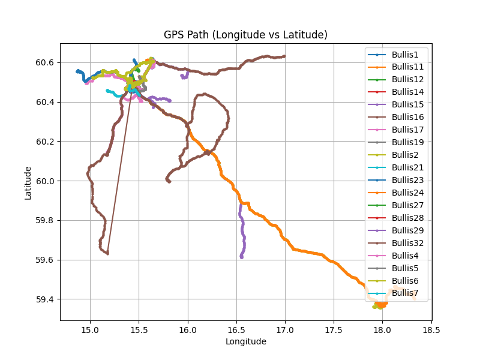
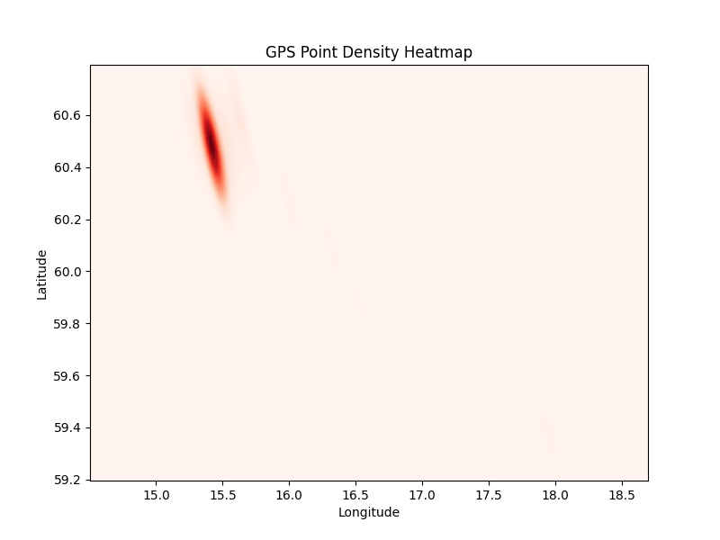

# Mobility Data Processor

This project processes raw **GPS `.gsd` mobility files** into structured Excel data and generates visualizations for mobility analysis.  
It was developed as part of the **Collecting Mobility Data** assignment (Task 1 and Task 2).

---

## 📂 Project Structure
```
mobility-data-processor/
 ├── data/                      # Folder with raw .gsd files
 │    ├── Bullis1.gsd
 │    ├── Bullis2.gsd
 │    └── ...
 ├── process_gsd_to_excel.py    # Task 1: Convert raw GPS data → Excel
 ├── visualize_gps_data.py      # Task 2: Create path plot & heatmap
 ├── AllTrips_Task1_Output.xlsx # Output Excel with processed data
 ├── gps_path_plot.png          # Longitude vs Latitude path
 ├── gps_heatmap.png            # Density heatmap of GPS points
 └── README.md                  # Project documentation
```

---

## ⚙️ Installation

1. Clone this repository or download the project folder.
2. Create and activate a virtual environment (recommended):

   ```bash
   python3 -m venv venv
   source venv/bin/activate   # macOS/Linux
   venv\Scripts\activate      # Windows
   ```

3. Install dependencies:

   ```bash
   pip install -r requirements.txt
   ```

Or install manually:

```bash
pip install pandas matplotlib seaborn openpyxl
```

---

## 🚀 Usage

### **Task 1: Process GPS files**
Converts raw `.gsd` files in the `data/` folder into an Excel dataset.

```bash
python3 process_gsd_to_excel.py
```

📌 Output:  
- `AllTrips_Task1_Output.xlsx` with **2 sheets**:  
  - **PointLevelData** → trip ID, point ID, coordinates, speed, distance, time difference, acceleration  
  - **TripSummary** → total distance, duration, average speed, average acceleration per trip  

---

### **Task 2: Visualize GPS data**
Generates visualizations from processed Excel data.

```bash
python3 visualize_gps_data.py
```

📌 Output:  
- `gps_path_plot.png` → Path of GPS points (Longitude vs Latitude)  
- `gps_heatmap.png` → Heatmap showing density of GPS points  

---

## 📊 Example Output

### GPS Path


### Heatmap


---

## 📑 Assignment Mapping

This project addresses the following assignment requirements:

**Task 1 – Data Processing**
1. Trip ID and Point ID creation  
2. Speed calculation in km/h  
3. Proper formatting of Date and Time  
4. Distance between consecutive points  
5. Time difference between consecutive points  
6. Average speed per trip  
7. Acceleration at each point  
8. Average acceleration per trip  
9. Trip duration and total distance  

**Task 2 – Visualization**
1. Path plot (Longitude vs Latitude)  
2. Heatmap showing density of GPS points  

---

## 👨‍💻 Author
Developed by **Chamindu Dilshan** for **Data Collection & Data Quality** coursework.  
